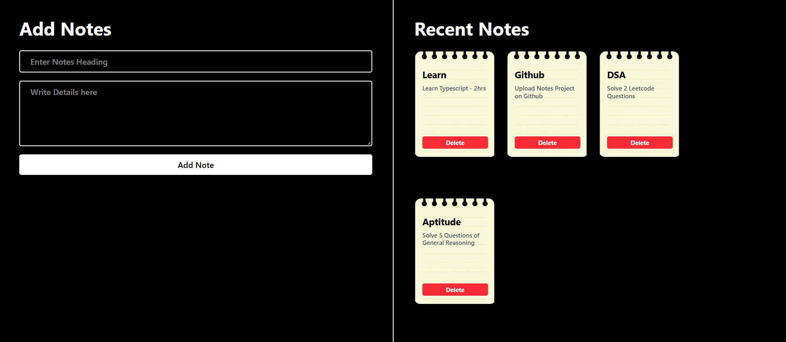

# 📝 Notes App

A simple Notes Application built using React.js that allows users to create and delete notes with an easy-to-use interface. The application helps users organize tasks, reminders, and ideas using a clean notebook-style design.

## Features

- Add new notes
- Delete notes
- Responsive user interface
- Notebook-style note cards
- Built with React.js

## Technologies Used

- React.js
- JavaScript
- HTML
- CSS

## Screenshot

## Live Demo

🔗 **Project Link:** https://notes-app-satyajeet-babar.vercel.app/